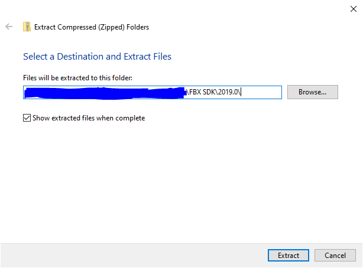
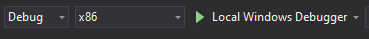

# Binding Of Ryesaac
A 3D game written in C++ using opengl

## Build
1. Clone the repository
 > git clone https://github.com/sg-p4x347/binding-of-ryesaac.git

2. Navigate to `FBX SDK/2019.0/`
3. Extract `lib.zip` to the same directory

	

4. Open `binding-of-ryesaac.sln` in Visual Studio 2019 or later
5. Build the solution on the x86 processor configuration

	
